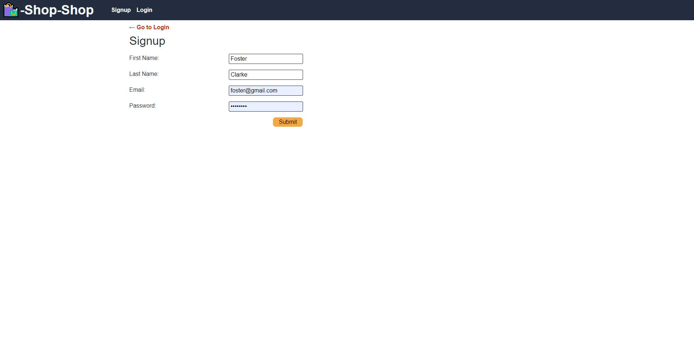

# 22 State Homework: Redux Store

## Shop Shop: E-Commerce Platform
This assignment is about managing global state, and refactoring React's Context API so that it uses [Redux](https://redux.js.org/).

## Technologies used
* React
* Redux
* Stripe
* Heroku

## User Story

```md
AS a senior engineer working on an e-commerce platform
I WANT my platform to use Redux to manage global state instead of the Context API
SO THAT my website's state management is taken out of the React ecosystem
```

## Acceptance Criteria

```md
GIVEN an e-commerce platform that uses Redux to manage global state
WHEN I review the app’s store
THEN I find that the app uses a Redux store instead of the Context API
WHEN I review the way the React front end accesses the store
THEN I find that the app uses a Redux provider
WHEN I review the way the app determines changes to its global state
THEN I find that the app passes reducers to a Redux store instead of using the Context API
WHEN I review the way the app extracts state data from the store
THEN I find that the app uses Redux instead of the Context API
WHEN I review the way the app dispatches actions
THEN I find that the app uses Redux instead of the Context API
```

## Deployed site: 

[Visit the deployed site](https://redxstore.herokuapp.com/)

The web application's general appearance and functionality is demonstrated below. 

The following animation shows how a user can register using the Signup page and then navigate to the Products page:



Users can select product directly or from a category and check product details. They can also add and remove products from their card:


The user can then go to the checkout:


## Licenses
MIT
